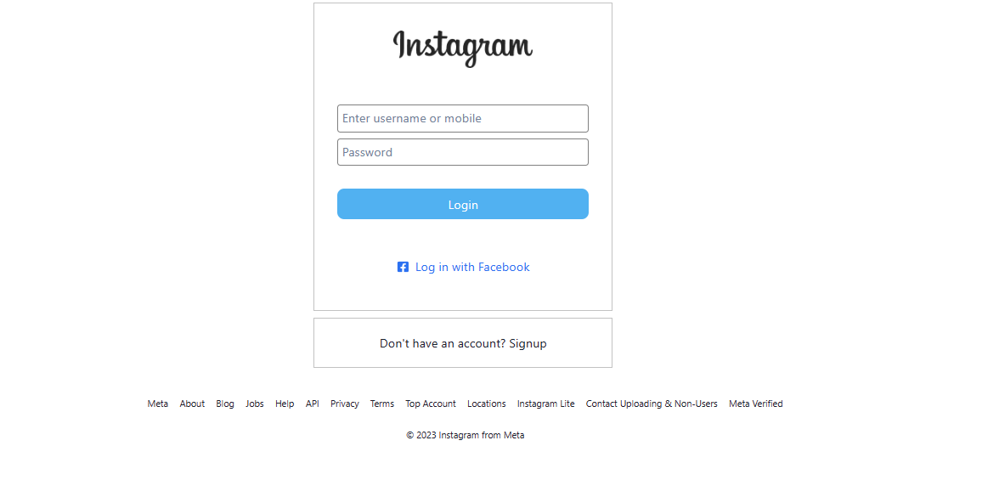
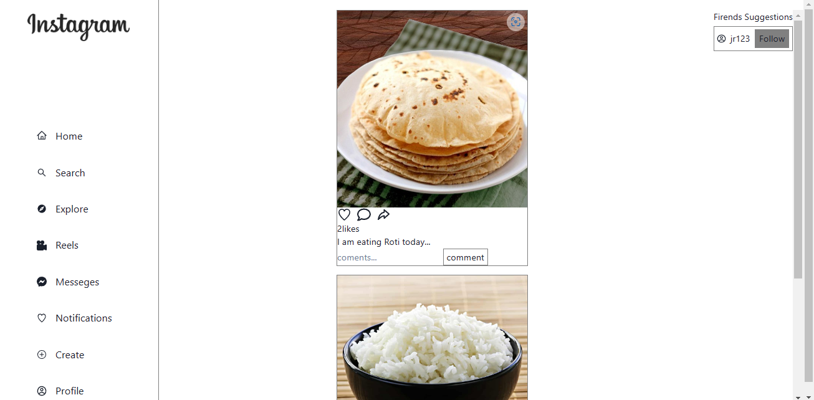

# INSTAGRAM-CLONE 

## About

### It is a social media website.

## Individual Project

- [JYOTIRANJAN MOHANTY](https://github.com/jyotiranjan1997)(Project Woner)

## Features

- Signup
- Login ( user login and admin login )
- Navbar
- Footer
- Home Page
- Post Create
- Comment and Like on Post
- Profile Page (With all curd operation)

## Tech-Stack and library

# Frontend

- HTML
- CSS
- JavaScript
- ReactJS (Frontend framework for building single page application)

# Backend

- MongoDB
- ExpressJS
- NodeJS

# Other Libraries

- Chakra-UI
- react-router-dom (For Routing pages)
- React Redux (Helps to manage state globally)

## Overview

- ### Signup or Register
  
  
 Before naviagate to main page user need to register with his details. User need to provide his email,name,username, password, date of birth.
 Then it will automatically navigate to login page.
  
- ### Login
  
  
  User need to fill email and password to login and then it redirect to home page.
  
  - ### Home Page
  
  
  home page it shows all posts and user can post comments and liks as well.
  
- ### Profile Dashboard
  
  
  user can edit his profile and also logout
  
- ### Post Create Page
  
  
  click on the create post then add post title and then click on the select image and upload then upload post.

