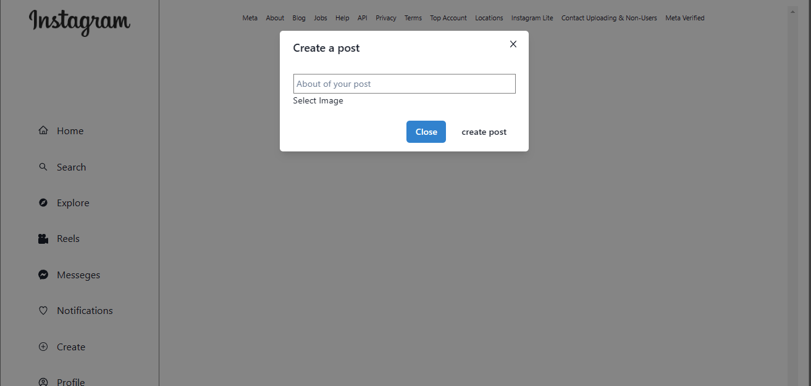

# INSTAGRAM-CLONE 

## About

### It is a social media website.

## Individual Project

- [JYOTIRANJAN MOHANTY](https://github.com/jyotiranjan1997)(Project Woner)

## Features

- Signup
- Login ( user login and admin login )
- Navbar
- Footer
- Home Page
- Post Create
- Comment and Like on Post
- Profile Page (With all curd operation)

## Tech-Stack and library

# Frontend

- HTML
- CSS
- JavaScript
- ReactJS (Frontend framework for building single page application)

# Backend

- MongoDB
- ExpressJS
- NodeJS

# Other Libraries

- Chakra-UI
- react-router-dom (For Routing pages)
- React Redux (Helps to manage state globally)

## Overview

- ### Signup or Register
  
- ### Login
  
  - ### Home Page
  
- ### Profile Dashboard
  
- ### Post Create Page
  

